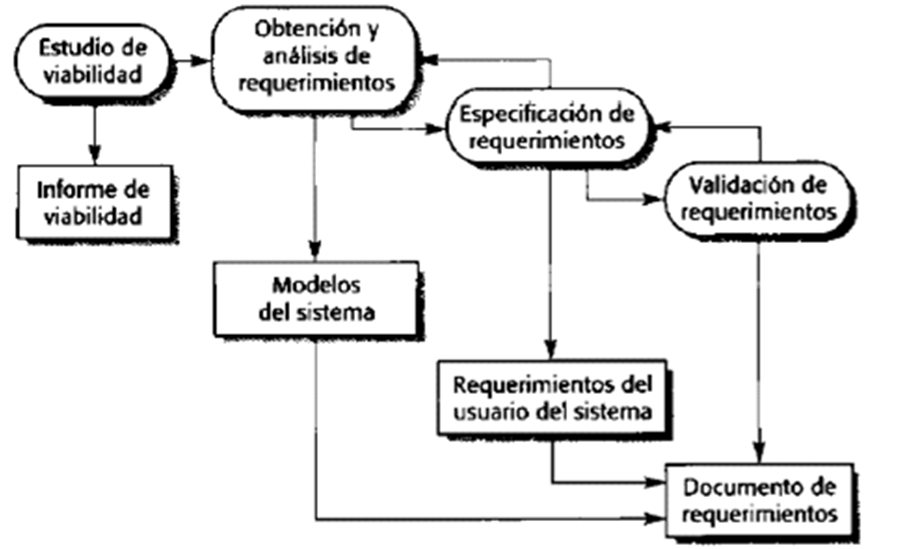

# Ingeniería de Software 1   
## Introducción a la materia 
 --- 
[Ingeniería de Software y de Requerimientos](./Ingeniería%20de%20Software%20y%20de%20Requerimientos.pdf)    

## Técnicas de especificación de requerimientos
 --- 
[Teoría 2 - Historias de Usuario](./TEC_ESP_REQ/teoria-2-historias-de-usuario.md)    
[Teoría 3 - Casos de Uso](./TEC_ESP_REQ/teoria-3-casos-de-uso.md)    
[Teoría 4 - Diagrama de Transición de Estados](./TEC_ESP_REQ/teoria-4-diagrama-de-transicion-de-estados.md)    
[Teoría 5 - Redes de Petri](./TEC_ESP_REQ/teoria-5-redes-de-petri.md)    
[Teoría 6 - Tablas de Decisión (y AE...)](./TEC_ESP_REQ/teoria-6-tablas-de-decision-y-ae.md)     
