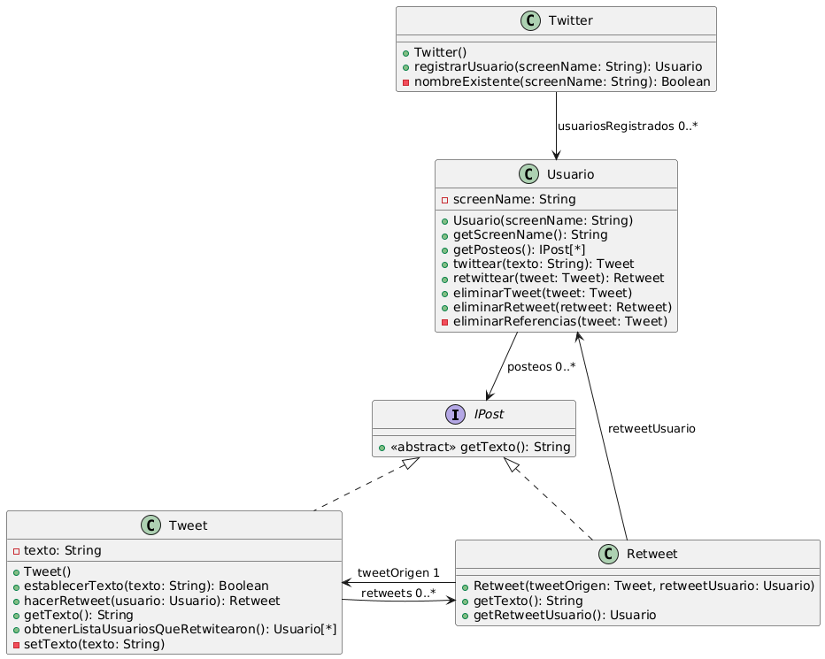

# Ejercicio 1: Red Social
## Enunciado (2025)
Se quiere programar en objetos una versión simplificada de una red social parecida a Twitter. Este servicio debe permitir a los usuarios registrados postear y leer mensajes de hasta 280 caracteres. Ud. debe modelar e implementar parte del sistema donde nos interesa que quede claro lo siguiente:
- Cada usuario conoce todos los Tweets que hizo.
- Un tweet puede ser re-tweet de otro, y este tweet debe conocer a su tweet de origen.
- Twitter debe conocer a todos los usuarios del sistema.
- Los tweets de un usuario se deben eliminar cuando el usuario es eliminado. No existen tweets no referenciados por un usuario.
- Los usuarios se identifican por su screenName.
- No se pueden agregar dos usuarios con el mismo screenName.
- Los tweets deben tener un texto de 1 carácter como mínimo y 280 caracteres como máximo.
- Un re-tweet no tiene texto adicional.

### Tareas:
Su tarea es diseñar y programar en Java lo que sea necesario para ofrecer la funcionalidad antes descrita. Se espera que entregue los siguientes productos.
1. Diagrama de clases UML.
2. Implementación en Java de la funcionalidad requerida.
3. Implementar los tests (JUnit) que considere necesarios.

## Solución propuesta

 [Código UML](./diagrama.uml)
### Notas
- Lo mas importante en este ejercicio es encontrar una forma de borrar los retweets que no tengan un tweet fuente porque este fue eliminado.
- Hay varias formas de resolver el ejercicio como, por ejemplo, contar con una lista para los posteos en la clase Twitter (que vendría a ser una clase Sistema), y de ahí eliminar los retweets necesarios. Cada forma tiene sus pros y contras, la que usé acá tiene como contra un acoplamiento mas fuerte entre los posteos y los Usuarios, pero a favor la forma de eliminar Retweets es mas simple, y la clase Twitter no interviene para nada.
