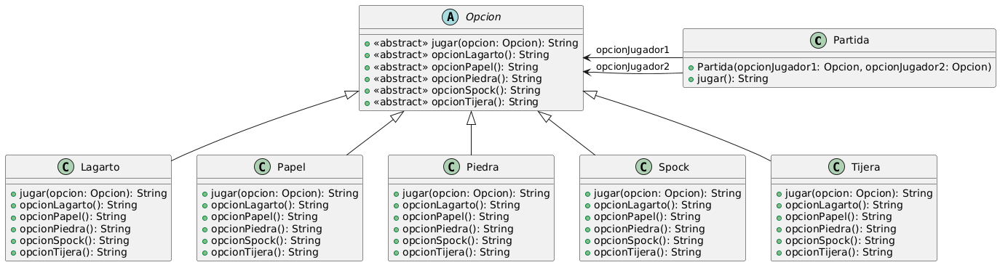

# Ejercicio 2: Piedra Papel o Tijera
## Enunciado (2025)
Se quiere programar en objetos una versión del juego Piedra Papel o Tijera. En este juego dos jugadores eligen entre tres opciones: piedra, papel o tijera. La piedra aplasta la tijera, la tijera corta el papel, y el papel envuelve la piedra. Los jugadores eligen una opción y se determina un ganador según las reglas: 
| | Piedra | Papel | Tijera |
| :---: | :--- | :--- | :--- |
| Piedra | _Empate_ | _Papel_ | _Piedra_ |
| Papel | _Papel_ | _Empate_ | _Tijera_ |
| Tijera | _Piedra_ | _Tijera_ | _Empate_ |

### Tareas:
1. Diseñe e implemente una solución a este problema, de forma tal que dadas dos opciones, determine cuál fue la ganadora, o si hubo empate
2. Se desea extender al juego a una versión más equitativa que integre a lagarto y Spock, con las siguientes reglas:<br>
<dl><dd><dl><dd><dl><dd>a. Piedra aplasta tijera y aplasta lagarto.<br></dd></dl></dd></dl></dd></dl>
<dl><dd><dl><dd><dl><dd>b. Papel cubre piedra y desaprueba Spock.<br></dd></dl></dd></dl></dd></dl>
<dl><dd><dl><dd><dl><dd>c. Tijera corta papel y decapita lagarto.<br></dd></dl></dd></dl></dd></dl>
<dl><dd><dl><dd><dl><dd>d. Lagarto come papel y envenena Spock.<br></dd></dl></dd></dl></dd></dl>
<dl><dd><dl><dd><dl><dd>e. Spock rompe tijera y vaporiza piedra.</dd></dl></dd></dl></dd></dl>
3. ¿Qué cambios se necesitan agregar? <br>Agregue los cambios a la solución anterior.

## Solución propuesta

<br>[Código UML](./diagrama.uml)
### Notas
- Lo mas importante en este ejercicio es encontrar una forma de lograr que cualquier opción (sea papel, tijera, etc) sea capaz de responderle a otra, de manera polimórfica.
- Una manera es utilizar la técnica de Double Dispatch y crear un método donde se reciba la opción contraria, y de esta se invoque el método asociado a la primera. Por ejemplo, dadas estas dos clases:
```java
public class Papel extends Opcion {
    public String jugar(Opcion opcion) {
        return opcion.opcionPapel();
    }

    public String opcionPiedra() { return "El papel cubre la piedra"; }
    public String opcionPapel() { return "Empate"; }
}

public class Piedra extends Opcion {
    public String jugar(Opcion opcion) {
        return opcion.opcionPiedra();
    }

    public String opcionPiedra() { return "Empate"; }
    public String opcionPapel() { return "El papel cubre la piedra"; }
}
```
Cuando se cree un objeto Papel _pa_ y un objeto Piedra _pi_, cuando se ejecute la sentencia _pa.jugar(pi)_, lo que va a pasar va a ser que se va a buscar dentro del objeto _pi_ el método _opcionPapel()_ y se va a ejecutar, obteniendo la respuesta deseada.
- Otra forma mas sencilla es sobrecargar el método jugar con las demás opciones, así una opción sabe como responder cuando le pasen otra por parámetro:
```java
public class Papel extends Opcion {
    public String jugar(Opcion papel) {
        return "Empate";
    }
    public String jugar(Opcion piedra) {
        return "El papel cubre la piedra";
    }
}
```
