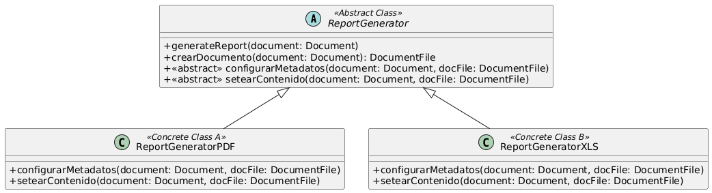

# Ejercicio de Refactoring: ReportGenerator
## Solución propuesta
1. **Enumere los code smell que encuentra en el código indicando las líneas afectadas**
  Tomando como punto de referencia el código original:
   - **Code Smell:** _Long Method_ (Líneas 5 - 44)
   - **Code Smell:** _Switch Statements_ (Líneas 6, 25)
   - **Code Smell:** _Duplicated Code_ (Líneas 6 - 14, 21 - 24, 27 - 33, 40 - 43)
   - **Code Smell:** _Comments_ (Líneas 7, 18, 23, 26, 37, 42)
   - **Code Smell:** _Loops_ (Líneas 1 - 13, 29 - 32)
   En general, voy a aplicar el refactoring (de Kerievsky) _Form Template Method_ para crear un método plantilla que contenga la lógica invariante, y deja las partes variantes a las subclases, declarando nuevos métodos abstractos a implementar
2. 1. Para solucionar el code smell _Long Method_ (y de paso el de _Duplicated Code_)
      - **Refactoring:** _Extract Method_ (Líneas 8 - 14).  >Copiar líneas dentro de un nuevo método llamado _crearDocumento(Document document)_  >Borrar líneas originales y reemplazar por invocación al nuevo método
      - **Refactoring:** _Replace Inline Code with Function Call_ (Líneas 27 - 33).  >Borrar las líneas y reemplazar por invocación al método _crearDocumento(Document document)_
   2. Para solucionar el code smell _Comments_
      - **Refactoring:** _Extract Method_ (Líneas 15 - 16).  >Copiar líneas dentro de un nuevo método llamado _configurarMetadatosPDF(DocumentFile docFile)_  >Borrar líneas originales y reemplazar por invocación al nuevo método
      - **Refactoring:** _Extract Method_ (Líneas 34 - 35).  >Copiar líneas dentro de un nuevo método llamado _configurarMetadatosXLS(Document document, DocumentFile docFile)_  >Borrar líneas originales y reemplazar por invocación al nuevo método
      - **Refactoring:** _Extract Method_ (Líneas 19 - 21).  >Copiar líneas dentro de un nuevo método llamado _setearContenidoPDF(Document document, DocumentFile docFile)_  >Borrar líneas originales y reemplazar por invocación al nuevo método
      - **Refactoring:** _Extract Method_ (Líneas 38 - 40).  >Copiar líneas dentro de un nuevo método llamado _setearContenidoXLS(Document document, DocumentFile docFile)_  >Borrar líneas originales y reemplazar por invocación al nuevo método
   3. Para solucionar el code smell _Switch Statement_...
      - **Refactoring:** _Replace Conditional with Polymorphism_.  > Declarar a la clase como abstracta.  > Declarar los métodos abstractos _configurarMetadatos(Document document, DocumentFile docFile)_ y _setearContenido(Document document, DocumentFile docFile)_.  >Crear dos subclases de ReportGenerator llamadas ReportGeneratorPDF y ReportGeneratorXLS.  > Hacer _Push Down Method_ con el método configurarMetadatos y setearContenido que le corresponda a cada subclase.  > Hacer Rename Method en cada subclase con los métodos nuevos, y llamarlos como se llama los métodos abstractos que se piden.  > En el método _generateReport(...)_, quitar el switch statement y reemplazarlo por las invocaciones a los dos métodos abstractos
   4. Para solucionar el code smell _Loops_...
      - **Refactoring:** _Replace Loop with Pipeline_.  > Reemplazar las líneas (10 - 13) por una sentencia stream equivalente.
## Resultado finala
 
[Código UML](./source_sol_ref.uml) 
[ReportGenerator.java](./ReportGenerator.java) 
[ReportGeneratorPDF.java](./ReportGeneratorPDF.java) 
[ReportGeneratorXLS.java](./ReportGeneratorXLS.java) 
