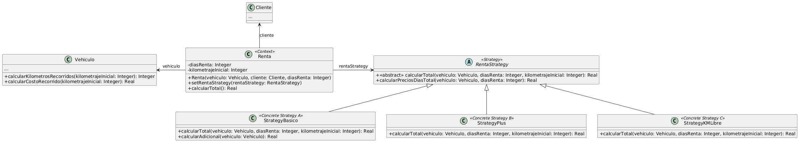

# Ejercicio de Refactoring: Renta de autos
## Solución propuesta
1. **Enumere los code smell que encuentra en el código indicando las líneas afectadas**
  Tomando como punto de referencia el código original:
    1. **Code Smell:** _Switch Statement_ (Líneas 22, 33)
    2. **Code Smell:** _Long Method_ (Líneas 21 - 38)
    3. **Code Smell:** _Duplicated Code_ (Líneas 23, 24, 25, 34, 35, 37)
    4. **Code Smell:** _Comment_ (Línea 27)
    5. **Code Smell:** _Temporary Field_ (Línea 26)
    6. **Code Smell:** _Feature Envy_ (Líneas 6, 23, 25, 34, 35)
2. 1. Para solucionar los code smells _Switch Statement_ y _Long Method_ aplico los siguientes refactorings:
      - **Refactoring:** _Replace Type Code with Strategy_ (Líneas 22, 23).
         -  Encapsular la variable 'tipoRenta' y crear un getter 'getTipoRenta(): String'
         -  Reemplazar las referencias a 'tipoRenta' dentro del método 'calcularTotal()' por un llamado a 'getTipoRenta()'
         -  Crear la clase 'RentaStrategy' Declarar adentro de la clase RentaStrategy un método abstracto llamado 'getTipoRenta(): String'
         -  Crear tres subclases de RentaStrategy, una por cada tipo de renta: 'StrategyBasico', 'StrategyPlus', y 'StrategyKMLibre'
         -  Implemenar en cada subclase el método abstracto mencionado previamente, y hacer que en cada caso devuelva 'basico', 'plus', y 'kilometraje_libre' respectivamente
         -  En la clase Renta, cambiar el tipo de la variable 'tipoRenta' por 'RentaStrategy', y también cambiar el nombre de la variable a 'rentaStrategy'. Acto seguido, cambiar toda ocurrencia que se encuentre en las líneas 15, 18 y 19
         -  Cambiar la declaración del método 'setTipoRenta' a 'setRentaStrategy'
         -  En la línea 15, cambiar la expresión que se le asigna a la variable 'rentaStrategy' por ' = new StrategyBasico();'
         -  En el método de la clase Renta de nombre 'getTipoRenta()', cambiar la expresión retornada por 'this.rentaStrategy.getTipoRenta();'
      - **Refactoring:** _Move Method_
         -  Dentro de la clase 'RentaStrategy' crear el método 'calcularTotal(vehiculo: Vehiculo, diasRenta: Integer, kilometrajeInicial: Integer): Double'
         -  Dentro del método copiar las líneas del método 'calcularTotal()' de la clase Renta, y adentro reemplazar 'this.kilometrajeInicial' por 'kilometrajeInicial'
         -  Borrar el cuerpo del método 'calcularTotal()' de la clase Renta, y poner en su lugar 'return this.rentaStrategy.calcularTotal(vehiculo, diasRenta, kilometrajeInicial);'
      - **Refactoring:** _Replace Conditional with Polymorphism_
         - En las subclases de 'RentaStrategy' crear un método con la declaración 'calcularTotal(vehiculo: Vehiculo, diasRenta: Integer, kilometrajeInicial: Integer): Double'
         - En la subclase 'StrategyBasico', copiar dentro del método las líneas 23 - 31 (del código del enunciado)
         - En el método de la superclase 'RentaStrategy', borrar la rama correspondiente al tipo de renta básico
         - En la subclase 'StrategyPlus', copiar dentro del método las líneas 34 - 35
         - Borrar la rama correspondiente al tipo plus en el método de la superclase
         - En la subclase 'StrategyKMLibre', copiar dentro del método la línea 37
         - Borrar la rama correspondiente al tipo 'kilometraje_libre'
         - Una vez que el método queda vacío, declarar como abstracta a la clase 'RentaStrategy', y declarar como abstracto al método
         - Borrar el método 'getTipoRenta()' en la clase Renta
         - Borrar el método abstracto 'getTipoRenta()' en la clase 'RentaStrategy', y el método idéntico en las subclases
   2.  Para solucionar los code smells _Feature Envy_ y _Duplicated Code_ aplico los siguientes refactorings:
      - **Refactoring:** _Extract Method_
         - Dentro de las subclases 'StrategyBasico' y 'StrategyPlus', crear un método con la declaración 'calcularKilometrosRecorridos(vehiculo: Vehiculo, kilometrajeInicial: Integer): Integer' como público
         - Dentro de ambos métodos, poner 'return vehiculo.getKilometraje() - kilometrajeInicial;'
         - Reemplazar en los métodos 'calcularTotal(...)' de ambas subclases la expresión que se le asigna a 'kilometrosRecorridos' por 'this.calcularKilometrajeRecorridos(...)'
      - **Refactoring:** _Extract Method_
         - Dentro de las subclases 'StrategyBasico' y 'StrategyPlus', crear un método con la declaración 'calcularCostoRecorrido(vehiculo: Vehiculo): Double'
         - Dentro de ambos métodos, poner 'return this.calcularKilometrosRecorridos() * vehiculo.getPrecioPorKM();'
         - Reemplazar en los métodos 'calcularTotal(...)' de ambas clases la expresión 'kilometrosRecorridos * vehiculo.getPrecioPorKM();' por 'this.calcularCostoRecorrido(vehiculo);'
      - **Refactoring:** _Extract Method_
         - Extraer como método la expresión 'diasRenta * vehiculo.getPrecioPorDia()' que se encuentra en los métodos 'calcularTotal(...)' de las subclases 'StrategyBasico' y 'StrategyKMLibre', y nombrarlo 'calcularPrecioDiasTotal(vehiculo: Vehiculo, diasRenta: Integer)'
         - Reemplazar las ocurrencias existentes por un llamado a este método
      - **Refactoring:** _Pull Up Method_
         - Traer el método 'calcularPrecioDiasTotal(...)' a la superclase
         - Eliminar los métodos del mismo nombre que estén en 'StrategyBasico' y 'StrategyKMLibre'
      - **Refactoring:** _Pull Up Method_
         - Traer para la superclase los métodos 'calcularKilometrosRecorridos(...)' y 'calcularCostoRecorrido(...)'
         - Eliminar las implementaciones de las subclases
      - **Refactoring:** _Move Method_
         - Crear en la clase 'Vehiculo' los siguientes métodos: 'calcularKilometrosRecorridos(kilometrajeInicial: Integer): Integer' y 'calcularCostoRecorrido(kilometrajeInicial: Integer): Double'
         - Dentro de cada método copiar el cuerpo de los métodos originales, pero sacar y cambiar las referencias que hagan falta
         - Cambiar las referencias dentro de la clase 'RentaStrategy' y sus subclases, para que ahora 'int kilometrosRecorridos' sea igual a 'vehiculo.calcularKilometrosRecorridos(kilometrajeInicial) y 'kilometrosRecorridos * vehiculo.getPrecioPorKM()' sea igual a 'vehiculo.calcularCostoRecorrido(kilometrajeInicial)'
         - Eliminar los métodos movidos de la clase RentaStrategy
   3.  Para solucionar el code smell _Comment_ aplico los siguientes refactorings:
      - **Refactoring:** _Extract Method_
         - Del método 'calcularTotal(...)', de la clase 'StrategyBasico', extraer las líneas 26 - 30 (que se pueden ver desde el código del enunciado), y con ellas hacer un método llamado 'calcularAdicional(vehiculo: Vehiculo)' en la misma clase
         - Cambiar las referencias necesarias
         - Quitar el comentario del nuevo método
    4.  Para solucionar el code smell _Temporary Field_ aplico los siguientes refactorings:
      - **Refactoring:** _Inline Temp_
         - Borrar el cuerpo del método 'calcularAdicional(vehiculo: Vehiculo)' y cambiarlo por 'return (vehiculo.getAntiguedad() > 5 ? 0.85 : 1);' 
## Resultado final
 
[Código UML](./solucionRefactoring/source.uml) 
[Renta.java](./solucionRefactoring/Renta.java) 
[RentaStrategy.java](./solucionRefactoring/RentaStrategy.java) 
[StrategyBasico.java](./solucionRefactoring/StrategyBasico.java) 
[StrategyKMLibre.java](./solucionRefactoring/StrategyKMLibre.java) 
[StrategyPlus.java](./solucionRefactoring/StrategyPlus.java) 
[Vehiculo.java](./solucionRefactoring/Vehiculo.java) 
