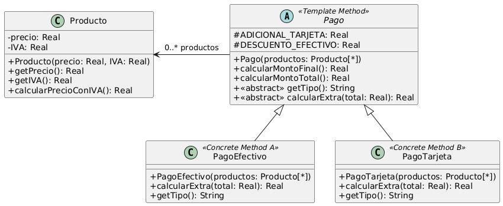

# Parcial 2024

---

```java
1. import java.util.List;
2. 
3. public class Pago {
4.     private List<Producto> productos;
5.     private String tipo;
6.     private static final double ADICIONAL_TARJETA = 1000.0;
7.     private static final double DESCUENTO_EFECTIVO = 2000.0;
8. 
9.     public Pago(String tipo, List<Producto> productos) {
10.         this.productos = productos;
11.         this.tipo = tipo;
12.     }
13. 
14.     public double calcularMontoFinal() {
15.         double total = 0.0;
16. 
17.         if (this.tipo == "EFECTIVO") {
18.             for (Producto producto : this.productos) {
19.                 total = total + producto.getPrecio() 
							+ (producto.getPrecio() * producto.getIVA());
20.             }
21.             if (total > 100000) {
22.                 total = total - DESCUENTO_EFECTIVO;
23.             }
24.         } else if (this.tipo == "TARJETA") {
25.             for (Producto producto : this.productos) {
26.                 total = total + producto.getPrecio() 
							+ (producto.getPrecio() * producto.getIVA());
27.             }
28.             total = total + ADICIONAL_TARJETA;
29.         }
30. 
31.         return total;
32.     }
33. }
////////
1. public class Producto {
2. 	private double precio; 
3. 	private double IVA;
4. 	
5. 	public Producto(double precio, double IVA) { 
6. 		this.precio = precio; 
7. 		this.IVA = IVA; 
8. 	}
9. 	
10. 	public double getPrecio() { 
11. 		return this.precio; 
12. 	}
13. 	
14. 	public double getIVA() {
15. 		return this.IVA;
16. 	}
17. }
```

### **Enumere los code smell que encuentra en el código indicando las líneas afectadas**

- **Long Method** —> Líneas 14 - 32
- **Switch Statement** —> Líneas 17, 24
- **Reinventando la Rueda** —> Líneas 18 - 20, 25 - 27
- **Código Repetido** —> Líneas 18 - 20, 25 - 27
- **Variable Temporal** —> Línea 15
- **Envidia de Atributos** —> Líneas 19, 26

### Indique qué refactorings utilizará para solucionarlos. Explique los pasos necesarios para realizar los refactorings elegidos, haciendo referencia al código cuando corresponda.

- **Code Smell**: Envidia de Atributos
    1. **Refactoring a aplicar**: Extract Method
        1. Crear método “*double calcularPrecioConIVA(Producto producto)*”
        2. Copiar el fragmento donde se suma el precio del producto con su IVA dentro del método, y colocarlo luego del return
        3. Reemplazar la línea antes mencionada por una invocación al método recien creado
        4. Reemplazar el fragmento idéntico de la línea 28 por una invocación al método recien creado
        
        ```java
        
        14.     public double calcularMontoFinal() {
        15.         double total = 0.0;
        16. 
        17.         if (this.tipo == "EFECTIVO") {
        18.             for (Producto producto : this.productos) {
        19.                 total = total + calcularPrecioConIVA(producto);
        20.             }
        21.             if (total > 100000) {
        22.                 total = total - DESCUENTO_EFECTIVO;
        23.             }
        24.         } else if (this.tipo == "TARJETA") {
        25.             for (Producto producto : this.productos) {
        26.                 total = total + calcularPrecioConIVA(producto);
        27.             }
        28.             total = total + ADICIONAL_TARJETA;
        29.         }
        30. 
        31.         return total;
        32.     }
        /////////////////////////////////////////////////////////////////////////////////
        				public double calcularPrecioConIVA(Producto producto) {
        					return producto.getPrecio() 
        						+ (producto.getPrecio() * producto.getIVA());
        				}
            }
        ```
        
    2. **Refactoring a aplicar**: Move Method
        1. Crear método “double calcularPrecioConIVA()” en la clase Producto
        2. Copiar adelante del return el código “producto.getPrecio() + (…)” y cambiar todas las referencias de ‘producto’ a ‘this’
        3. Cambiar en la línea 19 la invocación a ‘calcularPrecioConIVA(producto)’ por ‘producto.calcularPrecioConIVA()’
        4. Cambiar en la línea 26 la invocación a ‘calcularPrecioConIVA(producto)’ por ‘producto.calcularPrecioConIVA()’
        5. Borrar el método local ‘calcularPrecioConIVA(producto)’
    
    ```java
    
    14.     public double calcularMontoFinal() {
    15.         double total = 0.0;
    16. 
    17.         if (this.tipo == "EFECTIVO") {
    18.             for (Producto producto : this.productos) {
    19.                 total = total + producto.calcularPrecioConIVA();
    20.             }
    21.             if (total > 100000) {
    22.                 total = total - DESCUENTO_EFECTIVO;
    23.             }
    24.         } else if (this.tipo == "TARJETA") {
    25.             for (Producto producto : this.productos) {
    26.                 total = total + producto.calcularPrecioConIVA();
    27.             }
    28.             total = total + ADICIONAL_TARJETA;
    29.         }
    30. 
    31.         return total;
    32.     }
    ////////
    1. public class Producto {
    2. 	private double precio; 
    3. 	private double IVA;
    4. 	
    5. 	public Producto(double precio, double IVA) { 
    6. 		this.precio = precio; 
    7. 		this.IVA = IVA; 
    8. 	}
    9. 	
    10. 	public double getPrecio() { 
    11. 		return this.precio; 
    12. 	}
    13. 	
    14. 	public double getIVA() {
    15. 		return this.IVA;
    16. 	}
    17.
    18.   public double calcularPrecioConIVA() {
    19.     return this.getPrecio() + (this.getPrecio() * this.getIVA());
    20.   }
    17. }
    ```
    
- **Code Smell**: Switch Statement
    1. **Refactoring a aplicar**: Replace Type Code with Subclasses
        1. Declarar la clase Pago como abstracta
        2. Crear un getter y setter para el atributo ‘tipo’
        3. Reemplazar en el constructor “this.tipo = tipo” por “this.setTipo(tipo)”
        4. Reemplazar en las líneas 17 y 24 las referencias a la variable ‘tipo’ por una invocación a ‘getTipo()’
        5. Crear dos subclases ‘PagoEfectivo’ y ‘PagoTarjeta’ que extiendan de Pago
        6. Crear el constructor de las dos subclases
        7. Crear en ambas subclases un método ‘getTipo()’ que retorne “EFECTIVO” y “TARJETA” respectivamente
        8. Declarar el método local ‘getTipo()’ de la superclase como abstracto
        9. Borrar el setter ‘setTipo(…)’, la variable de instancia ‘tipo’, y cualquier referencia a esta
        10. Borrar el parámetro ‘tipo’ de los constructores de las subclases
    
    ```java
    // Clase Pago
    1. import java.util.List;
    2. 
    3. public abstract class Pago {
    4.     private List<Producto> productos;
    5.     private static final double ADICIONAL_TARJETA = 1000.0;
    6.     private static final double DESCUENTO_EFECTIVO = 2000.0;
    7. 
    8.     public Pago(List<Producto> productos) {
    9.         this.productos = productos;
    10.     }
    11.
    12.     public abstract String getTipo();
    13. 
    14.     public double calcularMontoFinal() {
    15.         double total = 0.0;
    16. 
    17.         if (this.getTipo() == "EFECTIVO") {
    18.             for (Producto producto : this.productos) {
    19.                 total = total + producto.calcularPrecioConIVA();
    20.             }
    21.             if (total > 100000) {
    22.                 total = total - DESCUENTO_EFECTIVO;
    23.             }
    24.         } else if (this.getTipo() == "TARJETA") {
    25.             for (Producto producto : this.productos) {
    26.                 total = total + producto.calcularPrecioConIVA();
    27.             }
    28.             total = total + ADICIONAL_TARJETA;
    29.         }
    30. 
    31.         return total;
    32.     }
    33. }
    
    // Clase PagoEfectivo
    1. public class PagoEfectivo extends Pago {
    2.     public PagoEfectivo(List<Producto> productos) {
    3.         super(productos);
    4.     }
    5.     
    6.     public String getTipo() {
    7.         return "EFECTIVO";
    8.     }
    9. }
    
    // Clase PagoTarjeta
    1. public class PagoTarjeta extends Pago {
    2.     public PagoTarjeta(List<Producto> productos) {
    3.         super(productos);
    4.     }
    5.     
    6.     public String getTipo() {
    7.         return "TARJETA";
    8.     }
    9. }
    
    // Clase Producto
    1. public class Producto {
    2.     private double precio; 
    3.     private double IVA;
    4.     
    5.     public Producto(double precio, double IVA) { 
    6.         this.precio = precio; 
    7.         this.IVA = IVA; 
    8.     }
    9.     
    10.     public double getPrecio() { 
    11.         return this.precio; 
    12.     }
    13.     
    14.     public double getIVA() {
    15.         return this.IVA;
    16.     }
    17.
    18.     public double calcularPrecioConIVA() {
    19.         return this.getPrecio() + (this.getPrecio() * this.getIVA());
    20.     }
    21. }
    ```
    
    1. **Refactoring a aplicar**: Replace Conditonal with Polymorphism
        1. Cambiar la visibilidad de la variable de instancia ‘productos’ y de las constantes a *protected*
        2. **Extraer el método** de las líneas 18 - 23, y llamarlo ‘calcularMontoFinalEfectivo(total)’
        3. **Extraer el método** de las líneas 25 - 28, y llamarlo ‘calcularMontoFinalTarjeta(total)’
        4. Copiar y pegar cada método recien creado en su respectiva subclase
        5. **Renombrar** ambos métodos como ‘calcularMontoFinal()’, agregar la variable total igual a 0 al principio del método, y borrar el parámetro
        6. **Extraer método** “calcularMontoTotal” con las líneas del for en ambas clases, agregarle una variable total igual a 0 al principio del método, y borrar el parámetro
        7. **Pull Up Method** “calcularMontoTotal” para la superclase
        8. **Extraer método** “calcularExtra(total)” con las líneas que le suman o restan algún valor al total
        9. Declarar “calcularExtra(total)” un método abstracto en la superclase
        10. Copiar el cuerpo del método “calcularMontoTotal” de cualquier subclase al método de la superclase
        11. Borrar los métodos “calcularMontoTotal” de las subclases
        12. Borrar los métodos “calcularMontoFinalTarjeta” y “calcularMontoFinalEfectivo” de la superclase
    
    ```java
    // Pago.java
    1. import java.util.List;
    2. 
    3. public abstract class Pago {
    4. 	protected List<Producto> productos;
    5.     protected static final double ADICIONAL_TARJETA = 1000.0;
    6.     protected static final double DESCUENTO_EFECTIVO = 2000.0;
    7. 
    8.     public Pago(List<Producto> productos) {
    9.         this.productos = productos;
    10.     }
    11. 
    12.     public double calcularMontoFinal() {
    13. 		double total = 0;
    14. 		total = calcularMontoTotal();
    15. 		total = calcularExtra(total);
    16. 		return total;
    17.     }
    18. 
    19. 	public double calcularMontoTotal() {
    20. 		double total = 0;
    21. 		for (Producto producto : this.productos) {
    22. 		    total = total + producto.calcularPrecioConIVA();
    23. 		}
    24. 		return total;
    25. 	}
    26. 	
    27. 	public abstract String getTipo();
    28. 	public abstract double calcularExtra(double total);
    29. }
    
    // PagoEfectivo.java
    1. public class PagoEfectivo extends Pago {
    2. 	public PagoEfectivo(List<Producto> productos) {
    3. 		super(productos);
    4. 	}
    5. 
    6. 	public double calcularExtra(double total) {
    7. 		if (total > 100000) {
    8. 		    total = total - DESCUENTO_EFECTIVO;
    9. 		}
    10. 		return total;
    11. 	}
    12. 	
    13. 	public String getTipo() {
    14. 		return "EFECTIVO";
    15. 	}
    16. }
    
    // PagoTarjeta.java
    1. public class PagoTarjeta extends Pago {
    2. 	public PagoTarjeta(List<Producto> productos) {
    3. 		super(productos);
    4. 	}
    5. 
    6. 	public double calcularExtra(double total) {
    7. 		total = total + ADICIONAL_TARJETA;
    8. 		return total;
    9. 	}
    10. 
    11. 	public String getTipo() {
    12. 		return "TARJETA";
    13. 	}
    14. }
    
    // Producto.java
    1. public class Producto {
    2. 	private double precio; 
    3. 	private double IVA;
    4. 	
    5. 	public Producto(double precio, double IVA) { 
    6. 		this.precio = precio; 
    7. 		this.IVA = IVA; 
    8. 	}
    9. 	
    10. 	public double getPrecio() { 
    11. 		return this.precio; 
    12. 	}
    13. 	
    14. 	public double getIVA() {
    15. 		return this.IVA;
    16. 	}
    17. 	
    18. 	public double calcularPrecioConIVA() {
    19. 		return this.getPrecio() + (this.getPrecio() * this.getIVA());
    20. 	}
    21. }
    ```
    
- **Code Smell**: Reinventando la Rueda
    1. **Refactoring a aplicar**: Replace Loop with Pipeline
        1. Reemplazar el for de ‘calcularMontoTotal()’ por un stream equivalente
    
    ```java
    19. 	public double calcularMontoTotal() {
    20. 		double total = 0;
    21. 		total = this.productos.stream()
    					.mapToDouble(p -> p.calcularPrecioConIVA()).sum();
    22. 		return total;
    23. 	}
    ```
    
- **Code Smell**: Variable Temporal
    1. **Refactoring a aplicar**: Inline Temp
        1. Dentro del método ‘calcularMontoTotal()’ reemplazar el cuerpo del método por la siguiente sentencia “return this.productos.stream().mapToDouble(p -> p.calcularPrecioConIVA()).sum();”
        2. Dentro del método ‘calcularMontoFinal()’ inicializar la variable total con el método ‘calcularMontoTotal()’ y borrar la línea 14
    
    ```java
    12.     public double calcularMontoFinal() {
    13. 		double total = calcularMontoTotal();
    14. 		total = calcularExtra(total);
    15. 		return total;
    16.     }
    17. 
    18. 	public double calcularMontoTotal() {
    29. 		return this.productos.stream()
    					.mapToDouble(p -> p.calcularPrecioConIVA()).sum();
    20. 	}
    ```
    

## Resultado final

---



```java
// Pago.java
1. import java.util.List;
2. 
3. public abstract class Pago {
4. 	protected List<Producto> productos;
5.     protected static final double ADICIONAL_TARJETA = 1000.0;
6.     protected static final double DESCUENTO_EFECTIVO = 2000.0;
7. 
8.     public Pago(List<Producto> productos) {
9.         this.productos = productos;
10.     }
11. 
12.     public double calcularMontoFinal() {
13. 		double total = calcularMontoTotal();
14. 		total = calcularExtra(total);
15. 		return total;
16.     }
17. 
18. 	public double calcularMontoTotal() {
19. 		return this.productos.stream()
				.mapToDouble(p -> p.calcularPrecioConIVA()).sum();	
20. 	}
21. 	
22. 	public abstract String getTipo();
23. 	public abstract double calcularExtra(double total);
24. }

// Producto.java
1. public class Producto {
2. 	private double precio; 
3. 	private double IVA;
4. 	
5. 	public Producto(double precio, double IVA) { 
6. 		this.precio = precio; 
7. 		this.IVA = IVA; 
8. 	}
9. 	
10. 	public double getPrecio() { 
11. 		return this.precio; 
12. 	}
13. 	
14. 	public double getIVA() {
15. 		return this.IVA;
16. 	}
17. 	
18. 	public double calcularPrecioConIVA() {
19. 		return this.getPrecio() + (this.getPrecio() * this.getIVA());
20. 	}
21. }

// PagoEfectivo.java
1. public class PagoEfectivo extends Pago {
2. 	public PagoEfectivo(List<Producto> productos) {
3. 		super(productos);
4. 	}
5. 
6. 	public double calcularExtra(double total) {
7. 		if (total > 100000) {
8. 		    total = total - DESCUENTO_EFECTIVO;
9. 		}
10. 		return total;
11. 	}
12. 	
13. 	public String getTipo() {
14. 		return "EFECTIVO";
15. 	}
16. }

// PagoTarjeta.java
1. public class PagoTarjeta extends Pago {
2. 	public PagoTarjeta(List<Producto> productos) {
3. 		super(productos);
4. 	}
5. 
6. 	public double calcularExtra(double total) {
7. 		total = total + ADICIONAL_TARJETA;
8. 		return total;
9. 	}
10. 
11. 	public String getTipo() {
12. 		return "TARJETA";
13. 	}
14. }
```
