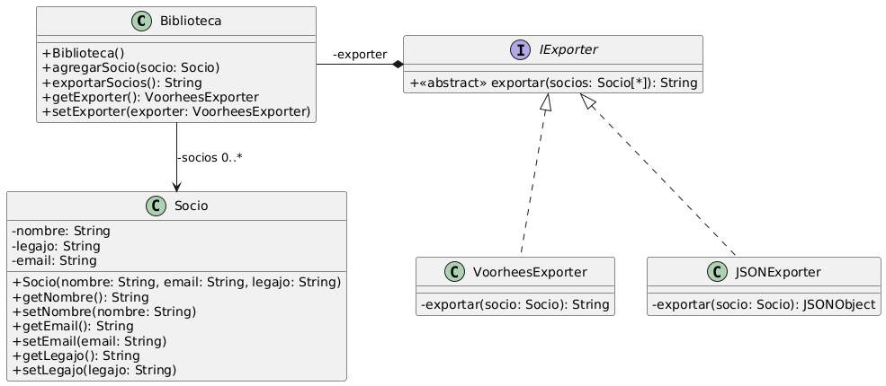

# Ejercicio 1: Friday the 13th en Java
## Solución propuesta

 [Código UML](./source.uml)
### Notas
- Para cambiar la forma de exportar la información de los socios que tiene la biblioteca, sin generar un cambio en el código de la clase, lo que hay que hacer es plantear una manera de que la nueva clase exportadora que se cree tenga métodos que tengan las mismas firmas (signatures) que la otra clase exportadora, osea, crear una interfaz para los Exportadores, donde a cualquier clase que la implemente se le pida definir un método público **exportar** que, dado un array de socios, devuelva un String.
- No estoy seguro si esto podría ser un caso del patrón Strategy
- Queda por implementar una clase JacksonExporter
