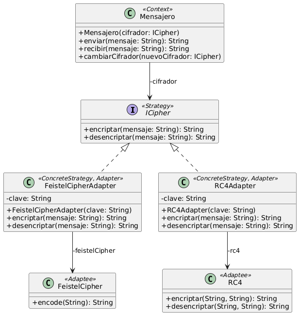

# Ejercicio 10: Mensajero
## Solución propuesta

 [Código UML](./source.uml) (Generado con Gemini)
### Notas
- Para la resolución del ejercicio utilicé el patrón Strategy y el Adapter
- Crée clases adaptadoras para los algoritmos cifradores, ya que quería mantener la interfaz y las clases lo mas uniformes posibles, y quería simular estar importando una librería externa
