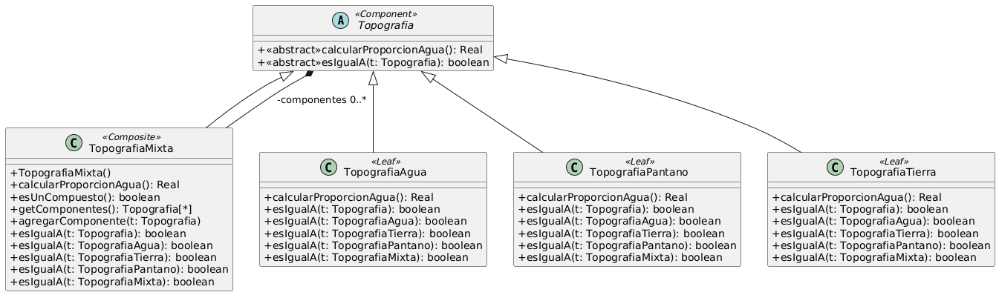

# Ejercicio 11: Topografías
## Solución propuesta

[Código UML](./source.uml) (Generado con Gemini)
### Notas
- En este ejercicio hay que usar el patrón Composite, ya que nos piden que una clase pueda contener otras clases y pueda operársele, o usarse, como si fuera otra clase con la misma interfaz que las otras (transparencia).
- Para contener varios primitivos en un compuesto, declaré un ArrayList privado en la clase TopografiaMixta. No estoy satisfecho con esta opción porque, al saber de antemano que solo van a haber 4 elementos a lo sumo, bastaría con un arreglo Tipografia[], y de paso ahorraría memoria y tiempo, pero terminé eligiendo el ArrayList porque el arreglo no cuenta con un método para agregar items de a uno, ni para preguntar si algún item cumple con una condición o no.
- Dentro de la clase se controla que no se agreguen mas de 4 componentes a la lista, ni que se agregue mas de un componente del tipo TipografiaMixta, con el método agregarComponente(). No estoy satisfecho con la implementación.
- En este ejercicio, lo que se pide que puedan comunicar todas las clases es que digan su proporción de agua y si son iguales a otro componente.
- Cuando se utiliza este patrón, hay que hacer un balance entre seguridad y transparencia en la declaración de operaciones, y ver cual se prefiere sacrificar de las dos. Yo en este caso preferí sacrificar la transparencia antes que la seguridad, ya que no quería que las hojas tuvieran un método agregarComponente() o siHayUnCompuesto(), no tenía sentido
