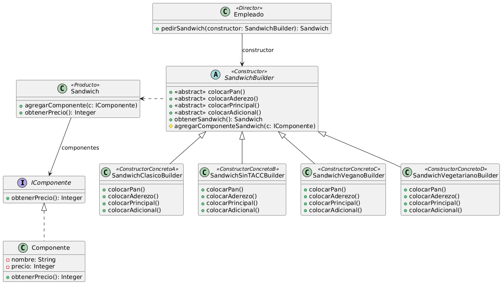

# Ejercicio 13: SubteWayTest
## Solución propuesta

[Código UML](./source.uml) (Generado con Gemini)
### Notas
- Usé el patrón Builder
- Opté porque todos los constructores implementen todos los métodos de la interfaz, no se pierde mucho creo
- Para construir cada tipo diferente de Sandwich, defino un método privado que invoca todos los métodos pasos para construir un sandwich a un constructor abstracto, y le paso ese constructor por parámetro, así desde otros métodos públicos puedo llamar a este método y pasarle un Builder de cada tipo para que me retorne el sandwich solicitado.
