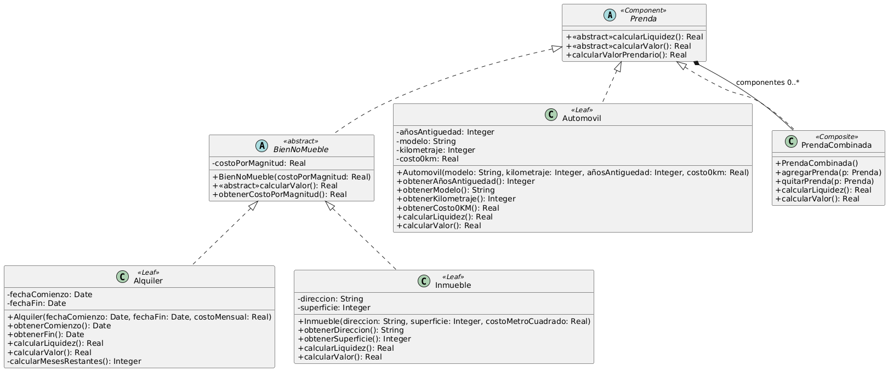

# Ejercicio 14: Préstamos Prendarios
## Solución propuesta
 
[Código UML](./source.uml) (Generado con Gemini)
### Notas
- En este ejercicio apliqué el patrón Composite
- Saqué una subjerarquía para generalizar algo del comportamiento que se encontraba en las clases Inmueble y Alquiler
- La clase que hace el rol del Composite declara algunas operaciones que no comparten las demas clases hermanas, por temas de seguridad
