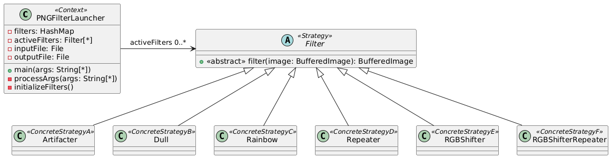
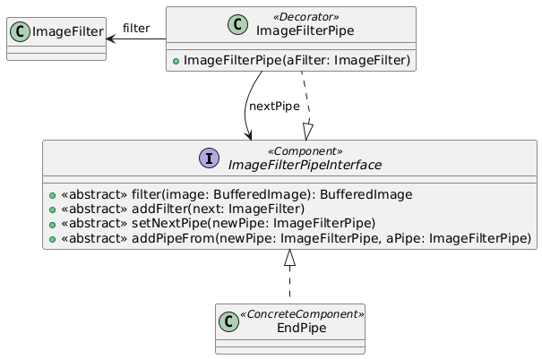
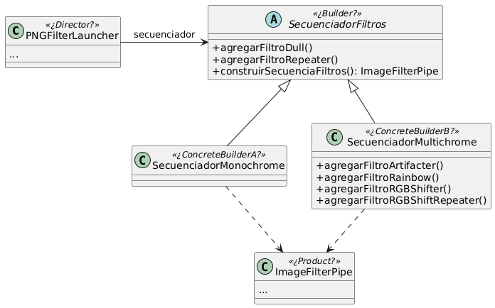

# Ejercicio 16: Filtro de imagenes
## Inciso A
 
[Código UML 1](./source1.uml)
### Notas
- Se puede ver que la librería adopta el patrón Strategy para encapsular los algoritmos de sus filtros.
- Lo que se hace desde la clase PNGFilterLauncher es:
- - Crear un Map y colocar dentro referencias a objetos que representan diferentes filtros
  - Pedir que el usuario le envíe al programa como argumento la ubicación de la imagen input, output, y los filtros deseados
  - Procesar los argumentos recibidos y agregar a la lista _activeFilters_ los filtros solicitados por el usuario
  - Leer la imagen desde la ubicación (comprobar si es válida)
  - Procesar la imagen para que sea transformable desde el programa
  - Aplicarle los filtros a la imagen, recorriendo la lista de filtros activos y aplicando uno por uno
  - Guardar la imagen final en la ubicación declarada
- a. Si, se distingue, pero la implementación no es la mas óptima. En este caso no hay mucho problema porque el orden de los filtros se mantiene cuando se pasan como argumentos para el programa, pero si se quisiera implementar esto mismo en una red social, tendría que replantearse el diseño
- b. Creo que sí.
- c. El único olor que encuentro es que las estrategias piden como parámetro la imagen en vez de la clase que hace el rol de Contexto en este sistema, el PNGFilterLauncher. Esto indica que quizás se tenga que utilizar el patrón Decorator.
## Inciso B
 
[Código UML 2](./source2.uml) 
Clase para [probar los pipes](./PipeTest.java)
### Notas
- a. Si, se distingue, vendría a ser el patrón Decorator
- b. No del todo, ya que la clase que tomara el rol de Componente y ComponenteConcreto serían el ImageFilter y las clases filtros respectivamente. Hay una indirección mas en este caso.
## Inciso C
 
[Código UML 3](./source3.uml)
### Notas
- Se debe encontrar una forma de armar una secuencia de filtros de manera que se respeten las reglas dadas.
- Hay esencialmente dos clases que comparten el propósito de ayudar a crear el mismo objeto, un secuenciador de filtros, pero ambas ofrecen métodos de construcción diferentes. Se asemejan a clases tipo Utility.
- Un solo patrón Builder por si solo no puede servir, a menos que se quiera incurrir en definir un montón de métodos vacíos para la clase secuenciadora de filtros monocromáticos, y se quiera crear solo un filtro, lo que le quitaría flexibilidad al PNGFilterLauncher o a cualquier usuario que quiera crear secuencias de filtros de manera dinámica.
- El patrón Factory, al menos como aparece en el libro, tampoco serviría mucho porque las subclases solo redefinen un **único** método de creación.
- Se podrían utilizar dos patrones Builders, teniendo dos directores que serían cada clase Secuenciador, pero siento que seguiría faltando flexibilidad.
- La solución que ofrezco no creo que sea buena, ni sigue algún patrón en específico, pero por lo menos permite crear una secuencia de filtros dada de manera dinámica.
