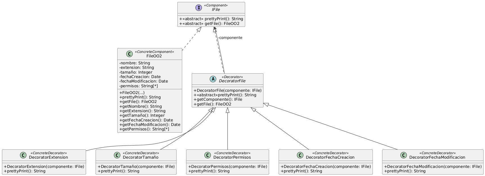

# Ejercicio 18: File Manager
## Solución propuesta
 
[Código UML](./source.uml)
### Notas
- Se tiene que aplicar el patrón Decorator
- Entiendo que no tengo que preocuparme por verificar si un Decorator se crea sobre un IFile que previamente había utilizado un Deorator de la misma clase (repetición de aspectos)
- No controlo el caso en el que se crea un Decorator sin un FileOO2
