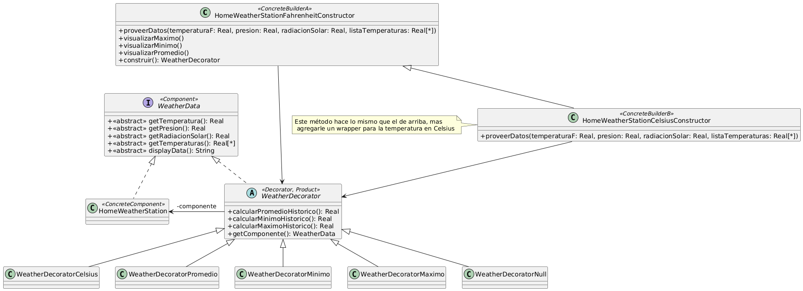

# Ejercicio 19: Estación meteorológica
## Solución propuesta

[Código UML](./source.uml)
### Notas
- En este ejercicio usé el patrón Decorator
- Hay que plantear un diseño que permita agregarle comportamiento dinámicamente a la clase HomeWeatherStation, y que permita cambiar en tiempo de ejecución la forma de leer la temperatura (de Fahrenheit a Celsius)
- Al igual que en el ejercicio 18, declaré en la clase que toma el rol Decorator un método que se supone que debería devolver el objeto HomeWeatherStation inicial
- Con respecto a la construcción de los WeatherDecorator, la misma discusión que en el ejercicio 16c
- Aplico el patrón Introduce Null Object para inicializar a las variables WeatherDecorator en los "constructores"
