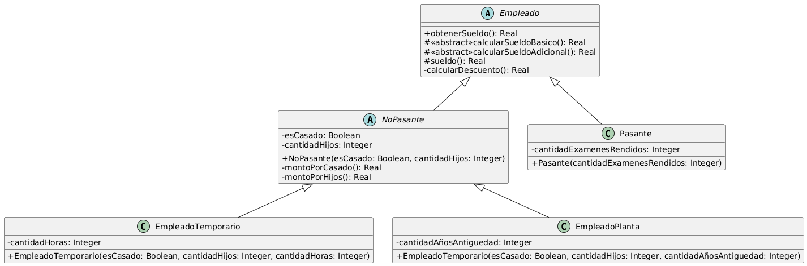

# Ejercicio 2: Cálculo de sueldos
## Solución propuesta

[Código UML](./source.uml)
### Notas
- En este ejercicio hay que encontrar una forma de generalizar el comportamiento que comparten las subclases _Temporario_ y _Planta_, sin que la otra subclase de la jerarquía tenga este comportamiento, ya que no lo utiliza.
- Entre los patrones el que más se parece a lo que necesita el ejercicio es el Decorator, que arega responsabilidades a objetos individuales. Pero no lo puedo utilizar porque tendría que mantener una referencia para Empleado en mis subclases Temporario y Planta, y no es lo que busco.
- La otra solución que se me ocurre es crear una segunda jerarquía, una clasificación _Pasante_ o _No-Pasante_, para que _Pasante_ no herede los métodos y las otras dos clases sí.
- Un patrón que aparece en este ejercicio es el de Template Method, cuando definimos *sueldo()*
