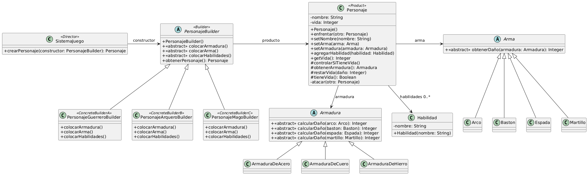

# Ejercicio 20: Construcción de personajes de juegos de rol
## Solución propuesta
 
[Código UML](./source.uml)
### Notas
- En este ejercicio tenemos las siguientes cuestiones a resolver principalmente:
  - Como llevar a cabo la mecánica del enfrentamiento ⟶ _Cuestión de implementación_
    - ¿Qué atributos deberían tener las clases Arma y Armadura?
    - ¿Qué metodos participarían de la lógica del enfrentamiento?
    - ¿Utilizar Double Dispatch para obtener polimórficamente el valor deseado en cierto caso?
  - Como construir las diferentes configuraciones de personajes, que siguen los mismos pasos ⟶ _Cuestion de diseño_
    - Patrón **Builder**
- Lanzo una excepción en el caso que un personaje quiera enfrentarse a otro sin tener vida
