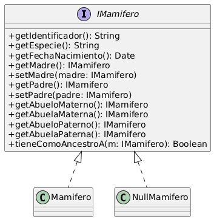
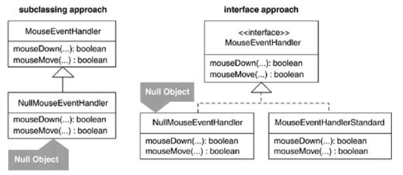

# Ejercicio 21: Genealogía salvaje
## Solución propuesta
 
[Código UML](./source.uml)
### Notas
- En este ejercicio tenemos que aplicar [el patrón Null Object](https://refactoring.guru/es/introduce-null-object) ya que necesitamos una manera de evitar duplicar todo el código utilizado para controlar los valores nulos, y de volver seguro al sistema de posibles null exceptions
- Opté por usar una interfaz para poder utilizar Mamifero y NullMamifero de manera intercambiable, pero también se podría haber hecho una subclase de Mamifero
  
