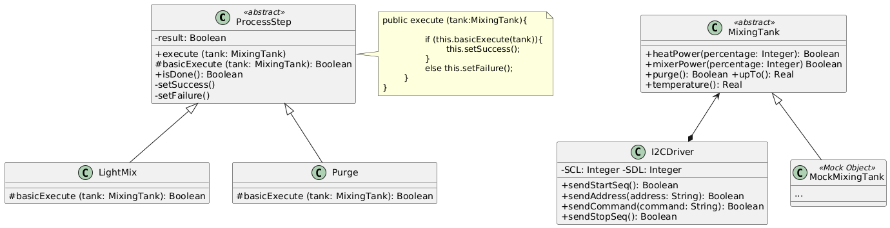

# Ejercicio 22: Monitoreo de línea de producción
## Solución propuesta
 
[Código UML](./source.uml)
### Notas
- En este caso necesitariamos un Test Double que nos permita verificar los valores que lleva dentro el objeto, para validar si la interacción del elemento que estamos probando del SUT con el DOC es correcta
