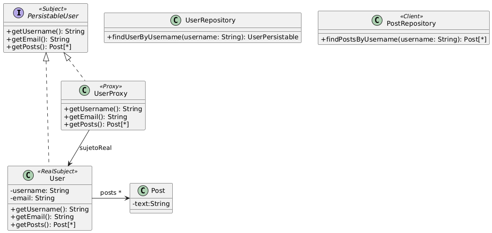

# Ejercicio 23: Acceso bajo demanda
## Solución propuesta
 
[Código UML](./source.uml)
### Notas
- La clase UserRepository, como está provista, no viene con ningún Post cargado ni forma de cargar los posts del usuario.
- Se pide buscar una forma de demorar la carga de los datos que tiene un usuario. Usé el patrón Proxy, específicamente la variante 'Virtual Proxy', que cumple con dicho propósito.
