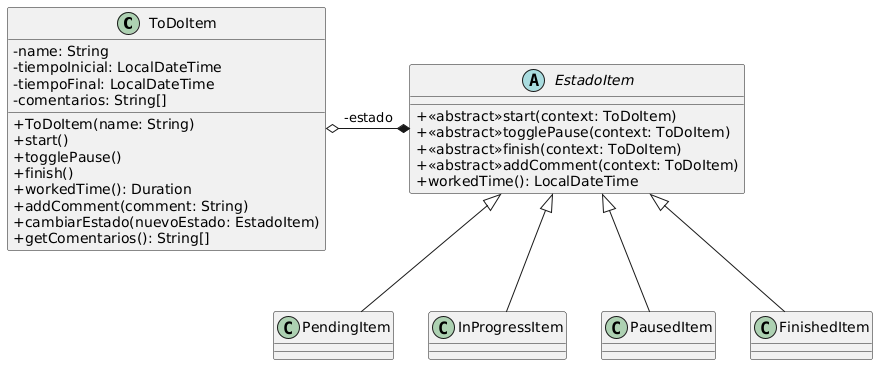

# Ejercicio 4: ToDoItem
## Solución propuesta

 [Código UML](./source.uml)
### Notas
- Se utilizó el patrón State
- Hay algo de acoplamiento en la solución planteada ya que cada Estado se comunica con el objeto ToDoItem para pedirle que se cambie de estado al deseado
