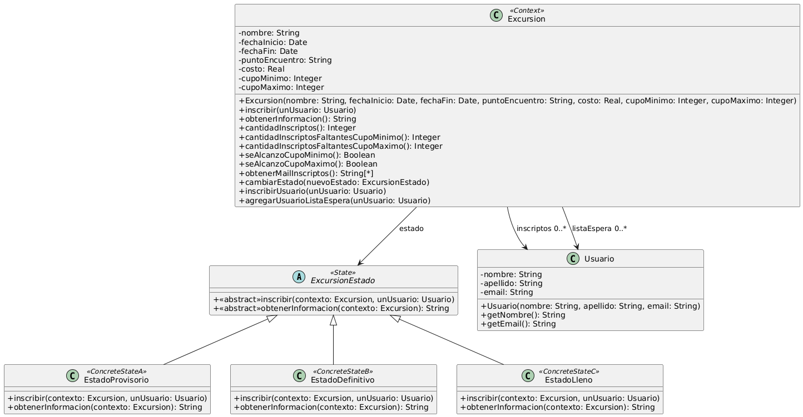

# Ejercicio 6: Excursiones
## Solución propuesta
 
[Código UML](./source.uml) (Generado con Gemini)
### Notas
- Mientras se vaya llenando de gente la excursión, esta va a cambiar su comportamiento en algunas partes de la Clase. En particular, en los métodos: 
  - +inscribir(unUsuario: Usuario)
  - +obtenerInformacion(): String
- Para resolver este ejercicio utilicé el patrón State ya que el comportamiento de un objeto depende de su estado (Provisorio, Definitivo, o Lleno), y debe cambiar en tiempo de ejecución dependiendo de ese estado. El patrón Strategy no hubiera servido porque se necesita que la inscripción de Usuarios sea diferente dependiendo del Estado de la Excursión, y para esto es necesario que la clase que se vaya a crear conozca a Excursión, lo que introduce acoplamiento y quiere decir que las dos clases que interactúan no son independientes, además de que los Estados deberían saber cuando cambiarse ellos mismos, y no debería cambiarse desde afuera.
- La clase Excursión me quedó grande, podría ser un indicio de mal olor
