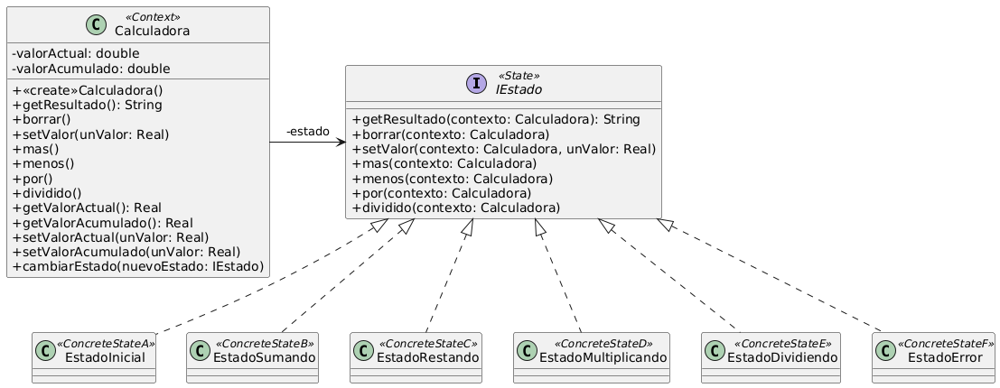

# Ejercicio 7: Calculadora
## Solución propuesta

 [Código UML](./source.uml) (Generado con Gemini)
### Notas
- Se utilizó el patrón State porque es óptimo para modelizar una calculadora, ya que esta tiene varios estados pero con las mismas operaciones, que hacen algo diferente en cada caso.
