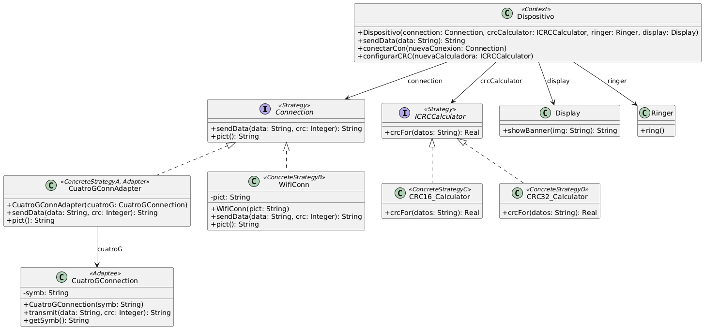

# Ejercicio 8: Dispositivo móvil y conexiones
## Solución propuesta

 [Código UML](./source.uml) (Generado con Gemini)
### Notas
- Se utilizó el patrón Strategy tanto para las calculadoras CRC como para las conexiones. Este patrón es la elección ideal en este caso ya que encapsula diferentes algoritmos que comparten la misma interfaz, y hace que se puedan intercambiar en tiempo de ejecución sin afectar alguna otra zona del código.
- Además, se utilizó el patrón Adapter para adaptar la clase 4GConnection, ya que no se podía cambiar la implementación de esta a riesgo de cambiar algo que pide la libreria que lo brinda.
- Se cambió el nombre de la clase "4GConnection" por el de "CuatroGConnection" ya que los nombres no pueden comenzar con números
- Falta terminar el test
