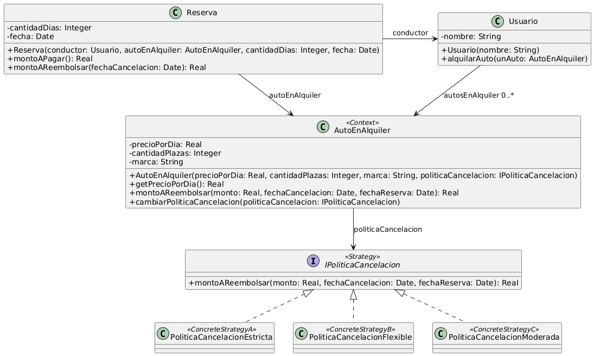

# Ejercicio 9: Dispositivo móvil y conexiones
## Solución propuesta

 [Código UML](./source.uml) (Generado con Gemini)
### Notas
- En este ejercicio apliqué el patrón Strategy para tratar el tema de las políticas de cancelación, ya que necesitaba una forma de relacionar varias clases que diferían en su comportamiento pero no en su interfaz.
- No me gusta del todo que solo una de las tres estrategias requiera de las fechas para calcular un valor, o que se tenga que pasar por medio de la clase AutoEnAlquiler para calcular el reembolso del monto que se calculo en Reserva
