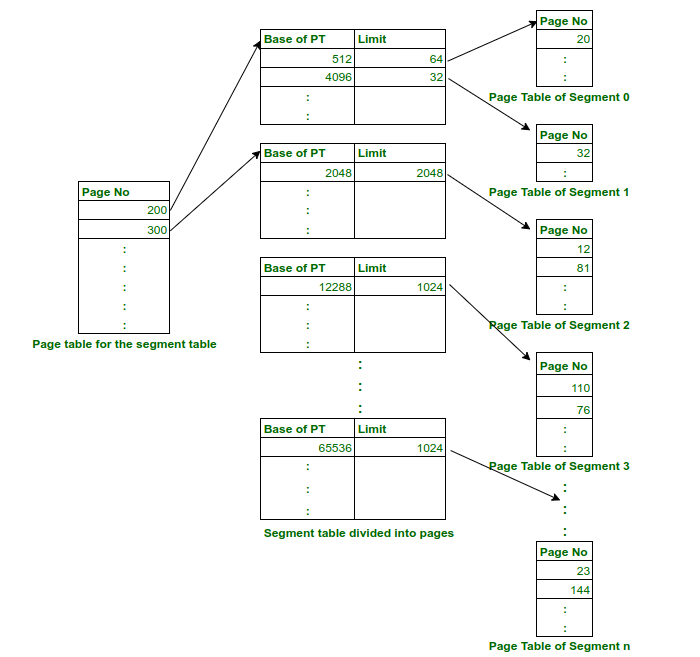

# Teoría 3 - Administración de Memoria (pt. 1)   
Las formas que surjan para encarar la forma de administrar la memoria en el Kernel tienen su base en los mecanismos que provee el Hardware (a los que está atado)   
Para que un programa se pueda ejecutar o un dato referenciar (directamente) ⟶ *debe estar en la RAM*   
Nunca habrá suficiente **memoria principal** *para poder contener a todos los programas y estructuras de datos que necesitan los procesos en ejecución y el Sistema Operativo*   
## Tareas del Sistema Operativo   
 --- 
- Llevar un registro de las partes de memoria que se están utilizando y las que no   
- Asignar espacio en memoria principal a los procesos cuando estos lo necesiten   
- Liberar el espacio de memoria asignado a procesos terminados   
- Lograr que el programador se abstraiga de la alocación de programas   
- Brindar seguridad entre los procesos para que unos no accedan las secciones privadas de otros   
- Brindar la posibilidad de acceso compartido a determinadas secciones de la memoria (como librerías)   
- **[STALLINGS]** Gestionar la transferencia entre memoria principal y secundaria para minimizar el efecto en el rendimiento que produzcan las operaciones de E/S   
   
El mayor uso eficiente que se le dé a la memoria, la mayor cantidad de procesos que se podrán ejecutar (*mayor grado de multiprogramación*)   
La operación principal de la Administración de Memoria es traer a la **memoria principal** los procesos para que el procesador los pueda ejecutar   
## Requisitos   
 --- 
### Reubicación   
- El programador no debe ocuparse de conocer donde será colocado el proceso en la RAM   
- Un proceso **en estado de ejecución** puede ser sacado y traído a la memoria y, posiblemente, colocado en direcciones distintas   
- Las referencias a la memoria se deben ir "traduciendo" según la ubicación actual de proceso (desplazamiento)   
   
### Protección   
- Los procesos no deben referenciar direcciones de memoria de otros procesos (salvo que tengan permiso)   
- Los procesos no pueden ejecutar instrucciones que no les corresponden   
- El chequeo se debe realizar durante la ejecución   
   
### Compartición   
- Permitir que varios procesos accedan a la misma porción de memoria principal (*esto se puede observar en segm.*)   
- Permite un mejor uso de la memoria RAM, evitando las copias innecesarias de instrucciones   
   
## Espacio de direcciones   
 --- 
El rango de direcciones (a memoria) posibles que un proceso puede utilizar para direccionar sus instrucciones y datos   
- El tamaño depende de la arquitectura del procesador   
- Es independiente de la ubicación "real" del proceso en la memoria RAM   
   
## Direcciones   
 --- 
### Lógicas   
- Referencia a una localidad de memoria independiente de la asignación actual de los datos en la memoria   
- Representa una dirección en el "Espacio de Direcciones del Proceso"   
   
### Físicas   
- Referencia a una localidad en la Memoria Principal (una **localidad real**)   
- Dirección absoluta   
   
[STALLINGS] **Dirección relativa ⟶** Dirección lógica expresada como ubicación relativa a algún punto conocido   
### Conversión de direcciones   
- **Registro base ⟶** Dirección que marca el comienzo del Espacio de Direcciones del proceso en la Mem. Pri.   
- **Registro límite ⟶** Dirección final del proceso / medida del proceso. Tamaño de su Espacio de Direcciones   
   
Ambos valores se fijan cuando el Espacio de Direcciones del proceso es cargado a memoria (osea cuando el proceso es llevado a memoria principal). Varían entre procesos (*context-switch*)   
**Address-binding ⟶** Transformar la dirección lógica en la dirección física correspondiente   
## Resolución de direcciones   
 --- 
- **En tiempo de compilación ⟶** Las direcciones lógicas y las direcciones físicas son idénticas   
- **En tiempo de ejecución ⟶** El hardware, desde el Memory Management Unit, realiza el mapeo entre direcciones lógicas y direcciones físicas   
   
## Memory Management Unit   
 --- 
Dispositivo de Hardware que mapea direcciones lógicas a físicas. Es parte del procesador. Solo en modo Kernel se puede reprogramar este dispositivo.   
- El valor en el "registro de realocación" es sumado a cada dirección generada por el proceso de usuario al momento de acceder a la memoria   
   
## Técnicas de gestión de la memoria   
 --- 
## Particiones   
Consiste en repartir la memoria principal en regiones con límites fijos. Esta técnica exige CONTINUIDAD   
### Particiones Fijas   
- La memoria se divide en particiones o regiones de tamaño fijo   
- Cada partición puede alojar un proceso, siempre que este mida igual o menos que el tamaño de la part.   
- Cada proceso se coloca de acuerdo con algún criterio (First Fit, Best Fit, Worst Fit…) en alguna partición   
- Susceptible de generar **fragmentación interna** ⟶ espacios libres en particiones   
- [STALLINGS] Si no hay ninguna partición libre, y no hay ningún proceso en estado *Listo *o *En ejecución*, el Sist. Operativo puede mandar al *área de swap* un proceso cualquiera alojado y cargar otro proceso en dicha partición   
   
### Particiones Dinámicas   
- Las particiones varían en tamaño y número   
- Alojan un proceso cada una   
- Cada partición se genera en forma dinámica del tamaño justo que necesita el procesador   
- Se produce **fragmentación externa** ⟶ huecos que van quedando en la memoria a medida que los procesos finalizan ⟶ solución ⟶ compactar la memoria   
   
## Paginación   
La **memoria principal** se divide, de manera lógica, en pequeños trozos de igual tamaño (**marcos**). La memoria virtual (el *espacio de direcciones *de todos los procesos) se divide en trozos de igual tamaño que los marcos (**páginas**).   
El SO mantiene una **tabla de paginas** por cada proceso, donde cada entrada contiene, entre otras cosas, el *marco *en la que se coloca cada *página* ⟶ Esta *tabla de páginas, que la guarda el Kernel,* la utiliza el MMU para "traducir" las direcciones lógicas a físicas   
- **Dirección lógica ⟶** número de página + desplazamiento adentro ⟶ lo utiliza el procesador para producir una **dirección física ⟶** número de marco + desplazamiento adentro   
   
00001 0000000000 = dirección lógica de 16 bits, donde los primeros 6 bits representan la página y los restantes el desplazamiento   
La diferencia entre **paginación y particionamiento fijo**, es que, en paginación, las porciones de memoria son mas chiquitas, un proceso puede apropiarse de varias páginas a la vez, y estas no deben estar o encontrarse contiguas las unas a las otras. Cuando un proceso se lleva a la memoria, todas sus páginas se tratan de cargar en los *marcos disponibles* que posea la RAM, y se establece una **tabla de páginas** del proceso   
## Segmentación   
El programa y los datos asociados se dividen en segmentos (con longitud máxima) ⟶ unidades de trabajo   
- No exige CONTINUIDAD   
- Hay tablas de segmentos (una para cada proceso) para mantener información de donde comienzan y donde terminan ⟶ se encuentran en la RAM ⟶ las crea el Kernel y sabe como son y cuanto miden   
- Sufre de **fragmentación externa**   
- La ventaja que ofrece esta técnica con respecto a paginación es que permite la **compartición** de segmentos de códigos (por ejemplo, si se abriesen 2 words, dos procesos podrían utilizar la misma porción de instrucciones)   
   
## Segmentación páginada   
Una combinación de las dos técnicas anteriores.   
A la memoria principal se suben páginas. Para cada segmento hay una tabla de páginas que modela donde fueron a parar las páginas, correspondientes a ese segmento. Si se comparte un segmento, automáticamente se comparten un conjunto de páginas relacionadas a dicho segmento.   
- El Sistema Operativo deberá mantener una tabla de segmentos y otra de páginas   
   
Los segmentos son usualmente múltiplos de páginas en tamaño, y no es necesario que todas las páginas se encuentren en memoria principal a la vez; además las páginas de un mismo segmento, aunque se encuentren contiguas en memoria virtual, no necesitan estarlo en memoria real.   
Las direcciones tienen tres componentes: (s, p, d), donde:   
s =número del segmento,
p = número de la página dentro del segmento
d = desplazamiento dentro de la página.   
    
    
