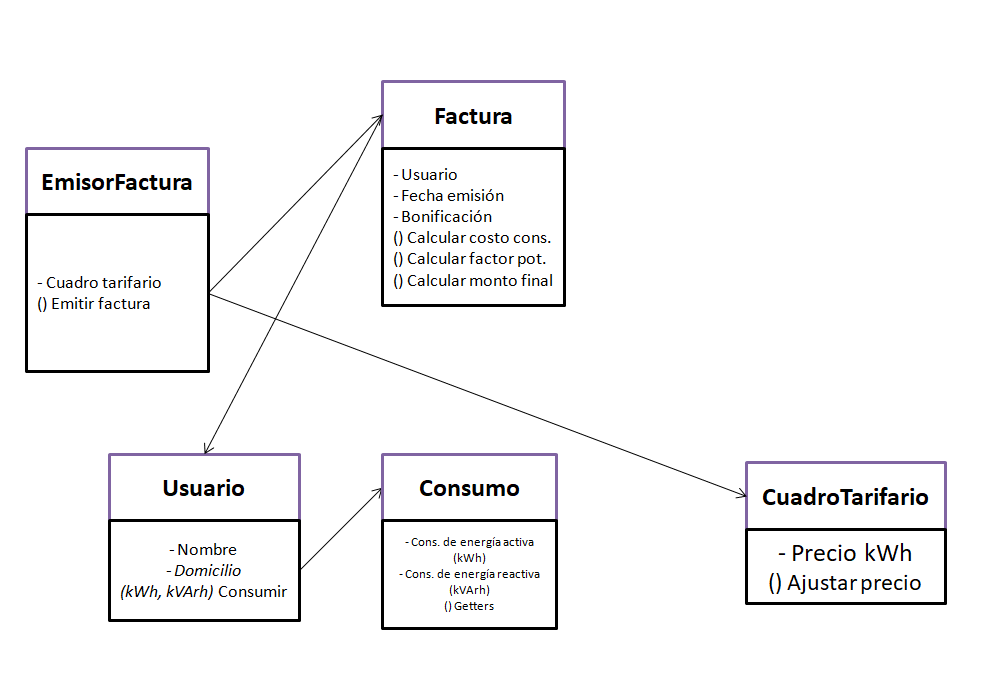

# Modelo de dominio
| Categoría de Clase Conceptual | Entidades |
| ----------- | ----------- |
| Roles de la gente | Usuario |
| Otros sistemas | EmisorFactura |
| Hechos | Consumo |
| Registros financieros | Factura, CuadroTarifario |

# Asociaciones entre conceptos
| Categoría | Asociación |
| ----------- | ----------- |
| A está lógicamente contenido en B | Consumo - Usuario |
| A usa o maneja a B | Factura - Usuario, EmisorFactura - CuadroTarifario |
| A está relacionado con la transacción B | EmisorFactura - Factura |
