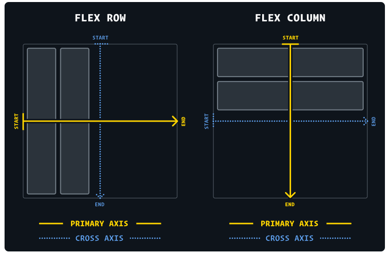
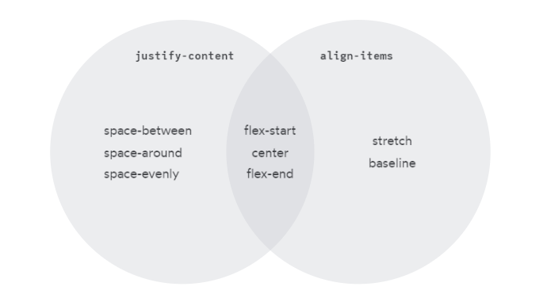

# CSS   
# Selectores   
 --- 
*Los selectores son elementos de HTML a los cuales se les aplican las reglas de CSS*   
- **Selector universal** ⟶ \* { }   
- **Selector de tipo **⟶ .(nombreClase) { }   
- **Selector de Id **⟶ #(nombreId) { } (solo usarlo en caso necesario)   
- **Selector de hijos ⟶** main > div   
- **Selector de hermanos adyacentes ⟶** .group1 + div
   
- **Selector de todos los hermanos adyacentes ⟶** .group1 ~ div   
- **Selector de atributos ⟶** [attribute] / selector[attribute] / [attribute="value"]   
[Attribute selectors - CSS: Cascading Style Sheets \| MDN](https://developer.mozilla.org/en-US/docs/Web/CSS/Attribute_selectors)    
- **Agrupación de selectores ⟶** .clase1, .clase2 { }   
- **Cadena de selectores ⟶** .clase1.clase2 / .clase1#id1 { }   
- **Combinador descendiente** ⟶ .claseAncestro .claseHijo { } (la cantidad de ancestros es ilimitada)   
   
# Propiedades   
 --- 
*A continuación solo hay algunas de las propiedades que ofrece CSS*   
- **color **⟶ Establece el color del texto de un elemento (acepta valores RGB(A), HEX, y HSL)   
- **background-color** ⟶ Establece el color de fondo de un elemento (acepta valores RGB(A), HEX, y HSL)   
- **font-family** ⟶ Establece el tipo de fuente que se utilizara para el texto de un elemento (se pueden colocar varias familias con coma, ya que si una de las fuentes no carga o no se encuentra disponible, el navegador utilizará la próxima en la lista)   
- **font-size** ⟶ Establece el tamaño de la fuente de texto de un elemento   
- **font-weight**   
- **text-align**   
- **height **⟶ Se puede utilizar la palabra clave 'auto' si se quiere mantener la proporción de la imagen en una de las dimensiones   
- width ⟶ Aplica lo mismo que arriba   
- **position ⟶** static \| relative \| absolute \| fixed \| sticky (left, right, bottom, up)   
[Fixed Headers And Jump Links? The Solution Is Scroll-margin-top \| CSS-Tricks](https://css-tricks.com/fixed-headers-and-jump-links-the-solution-is-scroll-margin-top/)    
   
# Cascada   
 --- 
*Información sobre las propiedades que tiene la cascada de CSS*   
- **Especificidad ⟶** Las declaraciones de CSS que sean mas "específicas" tomarán mas prioridad. La prioridad mas alta la tiene el inline style. Cuando hay multiples selectores, los IDs tomarán prioridad sobre los de clase, y estos sobre los de tipo   
- **Herencia ⟶** Son las propiedades de CSS que hereda los descendientes de un elemento, aunque no escribamos una regla que lo explicite   
-  **Regla del orden ⟶** Las reglas en CSS se van aplicando por el orden en que fueron colocadas   
   
# "The Box Model"   
 --- 
*Cada cosa que ves en una página web es esencialmente un rectángulo que contiene información y al que se le pueden aplicar reglas de CSS. Algunos de esos rectángulos se encuentran dentro de otros, y otros se encuentra afuera*   
- **Padding ⟶** Incrementa el espacio entre el borde y el contenido del elemento   
- **Border ⟶** Incrementa el espacio entre el padding y el margin   
- **Margin ⟶** Incrementa el espacio entre el borde y los bordes de los elementos ajenos   
- **box-sizing: border-box; ⟶** Propiedad que hace que un elemento "compense" la dimensión que extiende sus propiedades padding y border con la dimensión propiamente dicha del elemento (por defecto se pone en *content-box*)   
    
   
# Tipos de Display   
 --- 
*La propiedad **display **controla como aparecen los elementos en la página web. Esta sección muestra los diferentes tipos de display que puede tener cada elemento en CSS*   
- **block ⟶** Cada elemento usa una nueva línea (ej. div)   
- **inline ⟶** Cada elemento comparte línea con otros (ej. span)   
- **inline-block ⟶** Se comportan como elementos en-línea, pero con el padding y margin de un block (se respetan). La diferencia principal es que, a diferencia del *inline*, permite establecer un *width *y un *height *al elemento   
- **flex ⟶ **(block-level)   
- **grid**   
   
# Flex   
 --- 
*Foma de mostrar los elementos en una página web*   
- **flex-container** ⟶ elemento que tiene la propiedad "display: flex;"   
- **flex-item** ⟶ elemento contenido dentro de un *flex-container*; puede ser un flex-container a su vez   
- declaracion **flex **⟶ reune *flex-grow*, *flex-shrink*, y *flex-basis* (por ej. flex: 1 = flex-grow: 1; flex-shrink: 1; flex-basis: 0)   
- **flex-grow** ⟶ representa el "factor de crecimiento" de un item (no acepta valores negativos)   
- **flex-shrink **⟶ similar al de arriba, pero lo que establece es el "factor de achicamiento". solo se aplica si el tamaño de todos los flex-items es mas grande que el del flex-container. para hacer que los items se "encojan" uniformemente, hay que dejar el flex-shrink: 1; si no se quiere que se encojan, flex-shrink: 0 (no acepta valores negativos) se encojen hasta el **min-content**   
- **flex-basis** ⟶ establece el tamaño del flex-item. si se lo coloca en auto, busca una declaración de width o height (dependiendo de la *flex-direction*)   
- **flex: auto** ⟶ flex: 1 1 auto;   
- **flex: initial ⟶** establece el tamaño del item en base a las propiedades de dimensión. se puede encojer.   
- **flex: none ⟶** similar al de arriba, pero no se encoje. son items *totalmente inflexibles*   
- **flex-direction ⟶** establece la dirección del flex-container. por defecto está en flex-direction: row   
- **justify-content ⟶** cambia la distribución de los items, dentro del contenedor, a lo largo del eje principal (flex-start / center / flex-end / space-between / space-around / space-evenly)   
- **align-items ⟶** cambia la distribución de los items a lo largo del eje trasversal (stretch / flex-start / center / flex-end / baseline)   
- **align-self ⟶** propiedad del flex-item. establece su **distribución propia**, a lo largo del eje trasversal   
- **gap ⟶** establece un margen entre los items   
- min-width   
- flex-wrap ⟶    
    
    
   
# Unidades   
 --- 
### Absolutas   
Siempre son las mismas, independientemente del contexto   
- **px ⟶ **pixeles   
   
### Relativas   
- **em ⟶** 1em es el font-size de un elemento   
- **rem ⟶** 1rem es el font-size del root   
   
### Unidades del Viewport   
Estas unidades se relacionan con el tamaño de la zona rectangular visible de una web (el viewport)   
- vh ⟶ 1vh es 1% de la altura del viewport   
- vw ⟶ 1vw es 1% de la anchura del viewport   
[](https://codepen.io/codyloyd/pen/mdOXeMX)    
[Fun With Viewport Units \| CSS-Tricks](https://css-tricks.com/fun-viewport-units/)    
   
# Funciones   
 --- 
[CSS value functions - CSS: Cascading Style Sheets \| MDN](https://developer.mozilla.org/en-US/docs/Web/CSS/CSS_Functions)    
# Referencias   
 --- 
   
[A Complete Guide to Flexbox \| CSS-Tricks](https://css-tricks.com/snippets/css/a-guide-to-flexbox/)    
[FLEX: A simple visual cheatsheet for flexbox](https://flexbox.malven.co/)    
[flex - CSS: Cascading Style Sheets \| MDN](https://developer.mozilla.org/en-US/docs/Web/CSS/flex)    
# Algunas cosas útiles   
 --- 
```
<head>
	<link rel="stylesheet" href="styles.css">
</head>
```
   
[Online Interactive CSS Cheat Sheet](https://htmlcheatsheet.com/css/)    
[Cheat Sheet](https://docs.emmet.io/cheat-sheet/)    
[SvgPathEditor](https://yqnn.github.io/svg-path-editor/)    
[Material Symbols and Icons - Google Fonts](https://fonts.google.com/icons)    
[Using calc to figure out optimal line-height](https://kittygiraudel.com/2020/05/18/using-calc-to-figure-out-optimal-line-height/)    
[Fabulous Styleboard](https://fabulousgk.github.io/fabulous-styleboard/)    
[Browser Default Styles](https://browserdefaultstyles.com/)    
[Tailwind CSS - Rapidly build modern websites without ever leaving your HTML.](https://tailwindcss.com/)    
[Truncate String With Ellipsis \| CSS-Tricks](https://css-tricks.com/snippets/css/truncate-string-with-ellipsis/)    
[Modern Font Stacks](https://modernfontstacks.com/)    
[Free Fonts! Legit Free &amp; Quality » Font Squirrel](https://www.fontsquirrel.com/)    
[Choose a comfortable measure \| The Elements of Typographic Style Applied to the Web](http://webtypography.net/2.1.2)    
[background - CSS: Cascading Style Sheets \| MDN](https://developer.mozilla.org/en-US/docs/Web/CSS/background)    
[background-clip - CSS: Cascading Style Sheets \| MDN](https://developer.mozilla.org/en-US/docs/Web/CSS/background-clip)    
[overflow - CSS: Cascading Style Sheets \| MDN](https://developer.mozilla.org/en-US/docs/Web/CSS/overflow)    
[Pseudo-classes - CSS: Cascading Style Sheets \| MDN](https://developer.mozilla.org/en-US/docs/Web/CSS/Pseudo-classes)    
[Can I use... Support tables for HTML5, CSS3, etc](https://caniuse.com/)    
[Conventions](https://maintainablecss.com/chapters/conventions/)    
