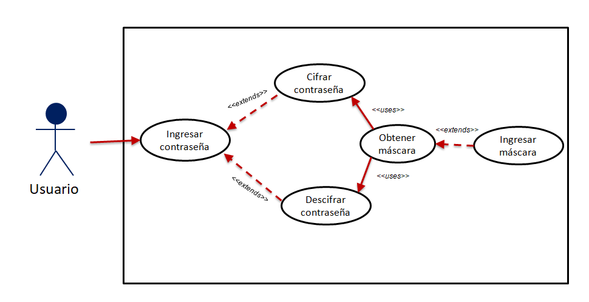

# Diagrama

# Casos de Uso

| Nombre  | Ingresar contraseña |
| ------------- | ------------- |
| **Descripción**  | *En este CU se especifica la forma en la que el usuario introduce la contraseña por teclado* |
| **Actores**  | Usuario  |
| **Precondiciones**  | --- |
| **Curso normal** | |
| Acciones del Actor | Acciones del Sistema |
| 1. El usuario ingresa la opción "1" | 2. El sistema le pide al usuario que ingrese una contraseña  |
| 3. El usuario ingresa la contraseña | 4. El sistema verifica que se haya introducido algo  |
| | 5. El sistema verifica que se utilicen carácteres válidos |
| | 6. El sistema verifica que la contraseña no supere el máximo establecido |
| | 7. El sistema guarda la contraseña y procede a procesarla |
| **Curso alterno** | |
| *PASO 4 ALTERNATIVO:* | No se ingresó nada. Se regresa al PASO 2 |
| *PASO 5 ALTERNATIVO:* | Hay caracteres inválidos en la contraseña ingresada. Se regresa al PASO 2 |
| *PASO 6 ALTERNATIVO:* | El límite de longitud establecido se superó. Se regresa al PASO 2 |
| **Postcondicion** | El sistema recibió la contraseña exitosamente |

 

| Nombre  | Obtener máscara |
| ------------- | ------------- |
| **Descripción**  | *En este CU se especifica la forma en la que el sistema obtiene una máscara para traducir la contraseña* |
| **Actores**  | Usuario  |
| **Precondiciones**  | Se debe tener una contraseña |
| **Curso normal** | |
| Acciones del Actor | Acciones del Sistema |
| -- | 1. El sistema le pregunta al usuario si desea que el sistema genere una secuencia de números para enmascarar la contraseña, o si prefiere ingresarla el mismo |
| 2. El usuario ingresa una opción | 3. El sistema recibe la opción y la valida  |
| | 4. El sistema genera una secuencia de números   4.1. El sistema ejecuta el CU <<*Ingresar máscara*>> |
| | 5. El sistema devuelve una máscara para ser utilizada |
| **Curso alterno** | |
| *PASO 3 ALTERNATIVO:* | La opción no es válida. Se regresa al PASO 1 |
| **Postcondicion** | El sistema devolvió una máscara con éxito |

 

| Nombre  | Ingresar máscara |
| ------------- | ------------- |
| **Descripción**  | *En este CU se especifica la forma en la que el sistema recibe una cadena máscara ingresada por el usuario* |
| **Actores**  | Usuario  |
| **Precondiciones**  | Se debe haber ejecutado previamente el CU <<*Obtener máscara*>> |
| **Curso normal** | |
| Acciones del Actor | Acciones del Sistema |
| -- | 1. El sistema le pide al usuario que ingrese una serie de números |
| 2. El usuario ingresa varios números | 3. El sistema recibe la serie de números y la válida |
| | 4. El sistema determina que la cadena de números es válida |
| **Curso alterno** | |
| *PASO 3 ALTERNATIVO:* | La cadena de números no es válida. Se regresa al PASO 1 |
| **Postcondicion** | El sistema tiene una cadena de números |

 

| Nombre  | Cifrar contraseña |
| ------------- | ------------- |
| **Descripción**  | *En este CU se especifica la forma en la que el sistema cifra la contraseña recibida del usuario* |
| **Actores**  | Usuario  |
| **Precondiciones**  | Se debe haber ejecutado previamente el CU <<*Ingresar contraseña*>> |
| **Curso normal** | |
| Acciones del Actor | Acciones del Sistema |
| -- | 1. El sistema necesita una cadena de números para enmascarar la contraseña. Se ejecuta el CU <<*Obtener máscara*>> |
| -- | 3. El sistema recibe la máscara |
| -- | 4. El sistema le aplica la máscara a la contraseña |
| -- | 4. El sistema cifra la contraseña y la imprime por consola |
| **Postcondicion** | Se cifró la contraseña con éxito |

 

| Nombre  | Descifrar contraseña |
| ------------- | ------------- |
| **Descripción**  | *En este CU se especifica la forma en la que el sistema descifra la contraseña recibida del usuario* |
| **Actores**  | Usuario  |
| **Precondiciones**  | Se debe haber ejecutado previamente el CU <<*Ingresar contraseña*>> |
| **Curso normal** | |
| Acciones del Actor | Acciones del Sistema |
| -- | 1. El sistema necesita una cadena de números para desenmascarar la contraseña. Se ejecuta el CU <<*Obtener máscara*>> |
| -- | 3. El sistema recibe la máscara |
| -- | 4. El sistema traduce la contraseña con la máscara recibida |
| -- | 4. El sistema descifra la contraseña y la imprime por consola |
| **Postcondicion** | Se descifró la contraseña con éxito |
